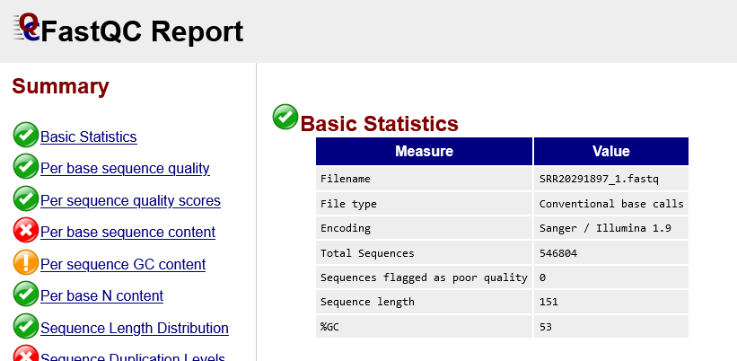
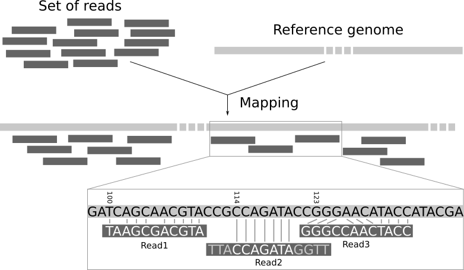
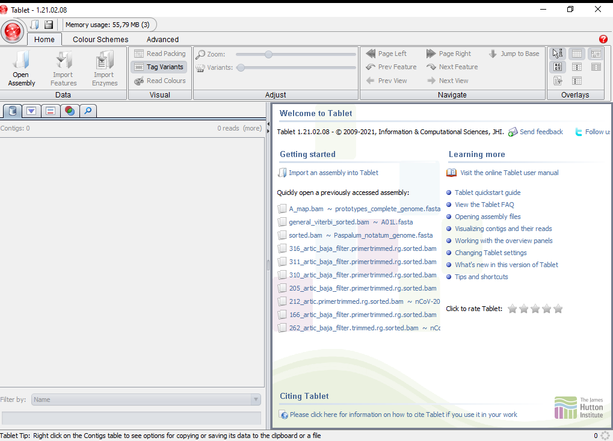
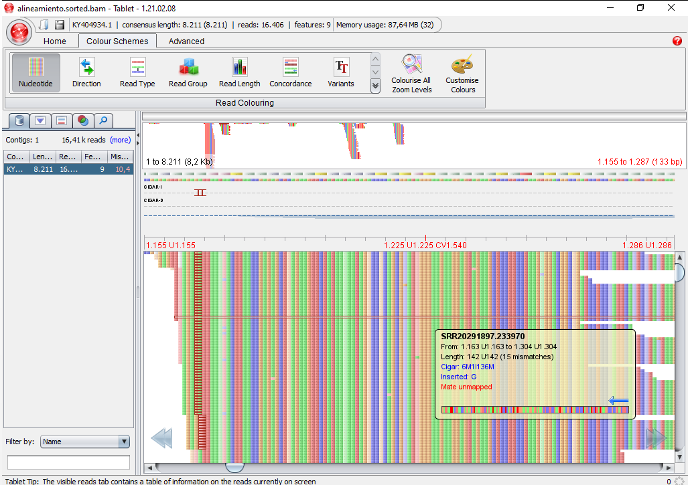

Marco Cacciabue (basado en gran medida en el trabajo de Natalia Aguirre
y Pablo Aguilera)

<!-- README.md is generated from README.Rmd. Please edit that file -->

## Alineamiento de Secuencias Illumina

Para la actividad propuesta utilizaremos secuencias disponibles desde el
repositorio publico <https://www.ncbi.nlm.nih.gov/sra>. En dicha
plataforma se pueden obtener una gran cantidad de datasets de distintas
muestras. Nosotros utilizaremos como prueba la muestra de Accession
Number:

``` bash
SRR20291897
```

Pueden copiar este numero y pegarlo en dicho repositorio para obtener
información específica de la muestra.

## :whale: Descargar imagen Docker

1.  Si todavia no tenes instalado Docker, seguí estos pasos:
    <https://www.docker.com/get-started>.
2.  Una vez instalado, abrir una terminal, *navegar a la carpeta del
    repositorio* y correr:

``` bash
docker pull cacciabue/pir2022:latest
```

y esperar a que la imagen se descargue. Esto solo se corre la primera
vez, o cada vez que se quiera controlar si hay actualizaciones en la
imagen disponibles.

Cuando la descarga este completa correr, segun tu sistema operativo:

``` bash
#Para windows correr
docker run -it --volume %cd%:/nexus cacciabue/pir2022:latest
```

``` bash
#Para Linux correr
docker run -it --volume $(pwd):/nexus cacciabue/pir2022:latest
```

Estos comandos inician un contenedor de Docker con todos los programas
necesarios para la actividad ya preinstalados. Ademas, vinculan el
contenedor con el sistema operativo huesped a traves de una carpeta
compartida.

Ahora si, comencemos con la actividad:

### 1. Exploración de carpetas

Primero, lo que vamos a hacer es ver en qué directorio estamos
posicionados utilizando el comando pwd (print working directory). Luego
de cada comando tenemos que presionar ENTER. Para ver cuál es el
contenido del directorio podemos utilizar el comando ls. Allí vamos a
visualizar un listado de carpetas, todas ellas aparecen en :green\_book:
verde.

Los archivos con los que vamos a trabajar se encuentran en la carpeta
FMDV\_work. Entonces, para cambiar el directorio de trabajo, usamos el
comando cd (change directory) hasta llegar a la carpeta en la que vamos
a trabajar.

``` bash
cd FMDV_work
ls
```

Dentro de la carpeta SRAdata tenemos los archivos de secuenciacion, ya
pre-descargados del SRA. Estos archivos fueron obtenidos con el
siguiente comando *(NO CORRER)*:

``` bash
# Descarga los archivos preprocesados de la muestra deseada en la carpeta llamada SRAdata. Si esa carpeta no existe la crea previamente.
prefetch SRR20291897 --output-directory SRAdata
```

Este comando produce, a partir de lo pre-descagargado, los archivos
fastq que seran los que realmente utilizaremos:

``` bash
# Este comando produce los archivos fastq que seran los que realmente utilizaremos. PUEDE tardar bastante tiempo. Pueden modificar el valor de los nucleos (threads) a usar si su maquina lo permite. 
parallel-fastq-dump --sra-id SRR20291897 --threads 4 --split-e --skip-technical --clip -O SRAdata
```

Luego, dentro de SRAdata, veremos los archivos de secuenciación. Para
ello utilizar el comando ls.

``` bash
cd SRAdata
ls
```

SRR20291897\_1.fastq SRR20291897\_2.fastq

Nota1: PRESTEN ATENCIÓN AL USO DE MAYÚSCULAS Y MINÚSCULAS al escribir,
porque Bash es sensible a esto (no es lo mismo SRAdata que sradata, que
SRADATA, etc).

Ahora volvemos a la carpeta anterior (subimos un nivel)

``` bash
cd ..
```

### 2. Control de calidad de las secuencias

Las tecnologías modernas de secuenciación pueden generar una gran
cantidad de secuencias (reads) en un solo experimento. Sin embargo,
ninguna tecnología de secuenciación es perfecta, y cada instrumento
generará diferentes tipos y cantidades de errores. Por lo tanto, es
necesario comprender, identificar y excluir los tipos de errores que
puedan afectar a la interpretación de los datos. El control de calidad
de la secuencia es, por lo tanto, un primer paso esencial en su
análisis. Detectar errores temprano ahorra tiempo más adelante. Para
esto utilizaremos el programa FastQC, que fue diseñado para calcular
estadísticas descriptivas y gráficos de los archivos de secuenciación
con formato fastq. Comenzaremos creando una carpeta en la que
guardaremos los resultados del análisis y ejecutaremos el FastQC para
todas las secuencias:

``` bash
mkdir 01_Quality_check
```

Para ver que la carpeta realmente se haya creado volvamos a utilizar el
comando ls y veremos que aparece dentro de la carpeta.

``` bash
ls
```

Para ejecutar el programa fastqc:

``` bash
fastqc SRAdata/*.fastq -o 01_Quality_check/
```

Nota2: Podemos ver que a fastqc le indicamos dos parámetros, las
secuencias a analizar y la carpeta donde queremos que guarde los
resultados (en este caso en 01\_Quality\_check/). Utilizamos el comodín
\*, que indica “cualquier nombre”, y seguido de .fastq, va a llamar a
todos los archivos que terminen .fastq y de esta manera analiza todas
las secuencias con un solo comando.

Una vez que terminemos de correr FastQC, notaremos que nos generó dos
archivos por cada fastq, un archivo .zip en el que se guardan los
resultados en un formato plano (poco práctico para que un humano los
lea) y un archivo .html con gráficos más intuitivos y útiles. Este
último archivo lo abrimos con cualquier explorador que tengamos
instalado (Chrome, Mozilla firefox, etc.) y a continuación veremos los
distintos resultados que nos ofrece.

● Estadísticas básicas: El primer resultado que observamos es una tabla
donde nos da información del nombre del archivo, el tipo de codificación
que tiene, el total de secuencias, el largo y el contenido de GC.



● Calidad de las secuencias por base: Este gráfico nos muestra en forma
colectiva la calidad de todas las secuencias por posición. Podemos ver
que en el eje X se encuentra la posición de cada base (por ejemplo, la
posición 1 corresponde a la primera base de TODAS las reads del archivo,
la posición 2 corresponde a la segunda base, etc.). El eje Y muestra las
puntuaciones de calidad. Cuanto mayor sea la puntuación, mejor será la
calidad de la base. El fondo del gráfico divide el eje Y en puntuaciones
de muy buena calidad (verde), puntuaciones de calidad razonable
(naranja) y posiciones de mala calidad (rojo).

.png)

● Calidad promedio de los reads: Este gráfico muestra el promedio de
calidad de todas las bases de todas las reads. En el eje X tenemos las
calidades de PHRED y en el eje Y tenemos cantidad de reads.

.png)

● Contenido de bases por posición: Este gráfico nos muestra el
porcentaje de cada base que hay en todos los reads en cada posición.

.png)

● Contenido de GC por read: Este gráfico nos muestra la cantidad de
reads que comparten un determinado porcentaje de GC.

.png)

● Contenido de bases faltantes o asignadas (N: cualquier base, IUPAC):
Este gráfico nos muestra el porcentaje de bases faltantes por posición
en los reads. Siempre esperamos que no haya Ns en nuestras secuencias,
en caso de encontrarlas habrá que ver cómo trabajar con ellas.

.png)

● Distribución del largo de secuencia: Este gráfico nos muestra cómo se
distribuye el largo de las secuencias. En el eje X tenemos el largo de
las secuencias y en el eje Y la cantidad de reads.

.png)

● Secuencias duplicadas: Este gráfico nos permite ver cuántos reads se
encuentran duplicados (la duplicación puede indicar problemas en el
armado de las bibliotecas o puede ser consecuencia de la metodología que
estemos utilizando ¡hay que estar atentos!)

.png)

● Contenido de adaptadores: FastQC revisa que nuestros reads no tengan
los adaptadores utilizados para la secuenciación. En caso de que se
encuentren, habrá que cortar (trimmear) los reads para que no
interfieran en los análisis siguientes.

.png)

### 3. Filtrado y trimming de las secuencias

En general, todas las tecnologías NGS suelen tener el problema de que la
calidad de las bases decae al final de las secuencias. Esto podría
causar sesgos en análisis posteriores con estos nucleótidos
potencialmente erróneos. Las secuencias deben tratarse para reducir este
sesgo. En general, los tratamientos de calidad incluyen:

● Trimming de las secuencias: en las regiones de puntuación de baja
calidad en el comienzo y final de secuencia quitar adaptadores ●
Filtrado de las secuencias: con puntuación de calidad media/baja
demasiado cortas con demasiadas bases ambiguas (N)

Para esto utilizaremos Bbduk.Lo que haremos será crear una carpeta donde
depositaremos las secuencias trimmeadas y correremos bbduk, con
parametros preestablecidos.

``` bash
mkdir 02_Trimmed

bbduk.sh in1=SRAdata/SRR20291897_1.fastq out1=02_Trimmed/1.fq in2=SRAdata/SRR20291897_2.fastq out2=02_Trimmed/2.fq ref=/programs/bbmap/resources/adapters.fa ktrim=r k=23 mink=11 hdist=1 tpe tbo qtrim=rl trimq=25 minlen=100 maq=25
```

Luego de que bdduk haya corrido, ir a la carpeta 02\_Trimmed y ver si
efectivamente se crearon los archivos, inspeccione alguno de ellos con
el programa FastqC.

### 4. Mapeo contra la referencia

La secuenciación produce una colección de secuencias sin contexto
genómico. No sabemos a qué parte del genoma corresponden. El mapeo de
los reads a un genoma de referencia es un paso clave en el análisis de
datos genómicos. Consiste en asignarle a cada read una posición en el
genoma de referencia. Un mapeador toma como entrada un genoma de
referencia y un conjunto de reads. Su objetivo es alinear cada lectura
en el genoma de referencia, permitiendo desajustes, indels y recorte de
algunos fragmentos cortos en los dos extremos:

 Actualmente, hay más de 60 mapeadores
diferentes y su número está creciendo. En este tutorial, usaremos
Bowtie2, una herramienta de código abierto rápida y eficiente en
memoria, particularmente buena para alinear reads, de aproximadamente 50
hasta 1000 pares de bases, a genomas relativamente largos.

Lo que haremos será crear una carpeta en la que guardaremos los índices
del genoma. Como el proceso de mapear cada read en el genoma de
referencia es costoso, tanto computacionalmente como en tiempo, Bowtie
ordena el genoma en índices (una manera que le permite ser más eficiente
y rápido). Esto lo hace con el comando bowtie-build, el cual genera seis
archivos, que luego utilizará para alinear los reads:

``` bash
bowtie2-build Referencia/A01L.fasta Referencia/ref_TP
```

Una vez armados los índices ejecutaremos el algoritmo bowtie2 para
mapear los reads. Este algoritmo puede tomar una gran cantidad de
parámetros (lo que lo hace una herramienta muy versátil). Nosotros
utilizaremos los siguientes: ● -p: Paraleliza el mapeo de los reads en
distintos núcleos para acelerar el proceso. ● -x: El nombre base del
índice que se debe buscar (El que indicamos en la función
bowtie2-build). ● -1: El nombre de las secuencias forward a mapear. ●
-2: El nombre de las secuencias reverse a mapear.

Por último, como bowtie2 imprime el resultado en pantalla, lo guardamos
con el símbolo &gt; para que nos quede en el archivo que deseamos (en
este caso ../04\_Mapped/ sub\_sar89-2015.sam). Por defecto este
algoritmo genera el alineamiento en formato SAM (Sequence Alignment
Map).

``` bash
mkdir 04_Mapped

bowtie2 -p 4 -x Referencia/ref_TP -1 02_Trimmed/1.fq -2 02_Trimmed/2.fq > 03_Mapped/alineamiento.sam
```

Ir a la carpeta 04\_Mapped e inspeccionar el archivo SAM recientemente
creado con el comando less -S. Para salir apretar la tecla q.

### 5. Estadísticas del mapeo

Una vez que termine bowtie2, convertiremos el archivo de mapeo .sam en
el formato binario .bam con el algoritmo samtools view. Esto debemos
hacerlo porque los programas como samtools y los visualizadores de
genomas, como tablet, utilizan este formato. Luego utilizaremos samtools
flagstat para que nos de un resumen de como estuvo el mapeo de las
secuencias.

``` bash
samtools view -S -b 03_Mapped/alineamiento.sam > 03_Mapped/alineamiento.bam

samtools flagstat 03_Mapped/alineamiento.bam > 03_Mapped/alineamiento.txt
```

En el archivo 04\_Mapped/alineamiento.txt, se encuentra guardado el
resumen hecho por flagstat. Aquí podemos ver que mapearon 16406
secuencias (que corresponden al 2.62% del total) y solo el 1.17%
mapearon correctamente el par forward/reverse.

625588 + 0 in total (QC-passed reads + QC-failed reads) 0 + 0 secondary
0 + 0 supplementary 0 + 0 duplicates 16406 + 0 mapped (2.62% : N/A)
625588 + 0 paired in sequencing 312794 + 0 read1 312794 + 0 read2 7340 +
0 properly paired (1.17% : N/A) 7954 + 0 with itself and mate mapped
8452 + 0 singletons (1.35% : N/A) 0 + 0 with mate mapped to a different
chr 0 + 0 with mate mapped to a different chr (mapQ&gt;=5)

### 6. Visualización del mapeo

Una vez que tenemos el archivo de alineamiento podemos visualizar los
reads sobre el genoma de referencia con un genome browser, en este caso
vamos a utilizar Tablet <https://ics.hutton.ac.uk/tablet/>

Antes de comenzar con esta sección tendremos que ordenar el archivo
.bam. Muchos programas requieren que los archivos BAM estén ordenados,
lo que se realiza de la siguiente manera:

``` bash
samtools sort 03_Mapped/alineamiento.bam -o 03_Mapped/alineamiento.sorted.bam
```

Además, los visualizadores como Tablet, necesitan que en la misma
carpeta donde esté guardado el archivo BAM ordenado exista uno
denominado .bai, indexado. Para generarlo debemos ejecutar el siguiente
comando:

``` bash
samtools index 03_Mapped/alineamiento.sorted.bam 03_Mapped/alineamiento.sorted.bam.bai
```

Para abrir Tablet lo podemos hacer desde el acceso directo en escritorio
(tiene que estar instalado en la computadora huesped) y le vamos a
indicar cual es el archivo de alineamiento sorted.bam queremos
visualizar y el FASTA del genoma de referencia A01L.fasta.



● Clickear en el botón rojo y seleccionar Open.

● Cargar el archivo de alineamiento sorted.bam en “Primary assembly file
or URL” y el genoma de referencia A01L.fasta en “Reference/consensus
file or URL”.

● Seleccionar el contig a visualizar. En este caso es uno solo porque es
el genoma de un virus.

● Recorrer el genoma y reconocer los segmentos de mayor profundidad:


